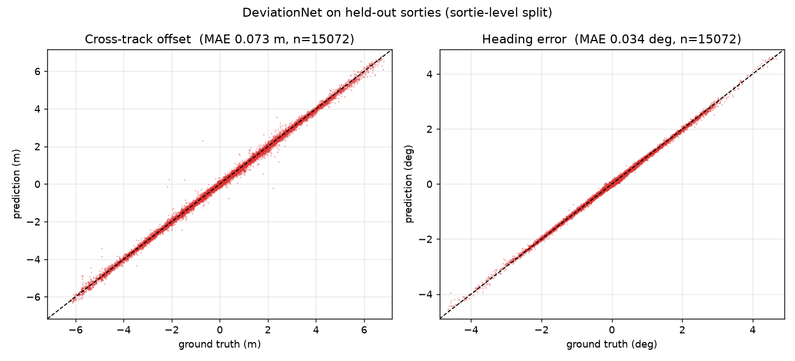
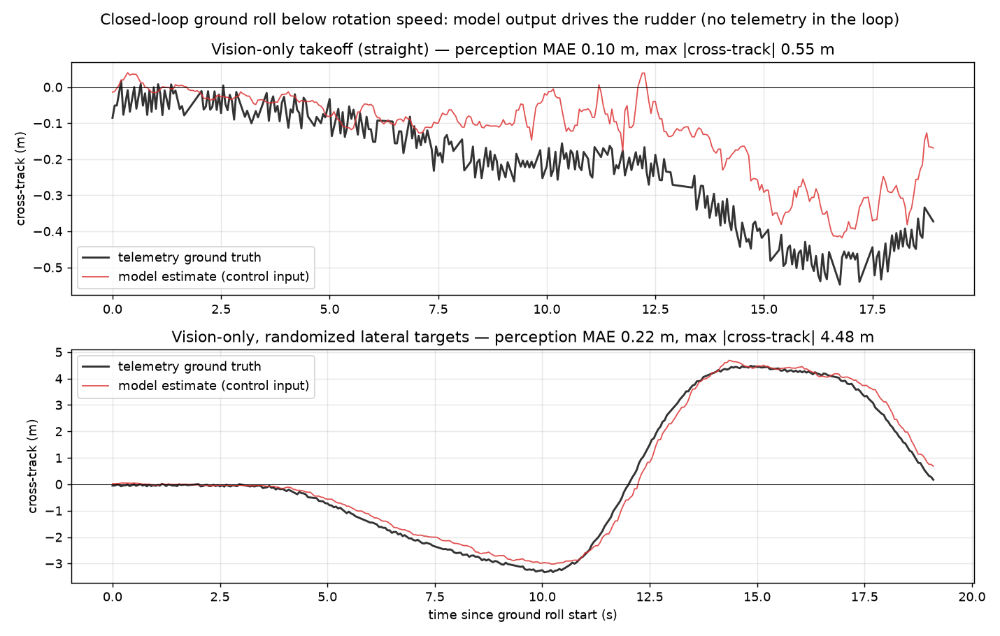

# Vision-Based Runway Perception & Takeoff Control

A 0.48M-parameter CNN looks at the cockpit view, estimates lateral deviation
from the runway centerline, and a conservative control law steers the aircraft
through the takeoff roll — **no GPS, no telemetry, camera only**. Trained and
deployed end-to-end on AMD hardware (ROCm training, MIGraphX inference).

This release contains the **raw dataset**, the **open weights**, and the code
to verify both. The control law emits normalized stick/rudder/throttle
commands, designed to compose with a downstream humanoid cockpit robot
pipeline.

## Results

| Metric | Value |
|---|---|
| Cross-track MAE (held-out sorties) | **0.073 m** (RMSE 0.114 m, fit slope 0.994) |
| Heading-error MAE | **0.034°** (RMSE 0.046°) |
| Closed-loop takeoff, max centerline deviation | **0.55 m** (vision-only) |
| Live perception MAE during closed-loop roll | 0.10 m (straight) / 0.22 m (±5 m maneuvers) |
| Inference on AMD gfx906 (MIGraphX) | **2110 frames/s** — 0.47 ms/frame |
| Inference on desktop CPU (onnxruntime) | 1.2 ms/frame |
| Model size | 0.48 M params (1.9 MB ONNX) |

### Offline: prediction vs. ground truth on 15,072 held-out frames



The split is **sortie-level** (52 whole sorties held out) — consecutive frames
are nearly identical, so a frame-level split would leak. Fit slope 0.994 means
no systematic under-response. Error stays uniform along the runway, including
a visually degraded worn-asphalt section (0.054 m MAE there).

### Closed loop: the model is the only sense of where the runway is



Model output replaces telemetry as the sole lateral input to the controller.
Top: straight takeoff, max deviation **0.55 m** over the full roll, zero
fallback ticks. Bottom is the stress test: the controller is fed randomized
lateral target offsets and the aircraft weaves across the runway at up to
100 kt, tracking commanded offsets out to ±4.5 m and returning to centerline.

## Open weights

`weights/deviation.onnx` (+ `.data`) is the exact checkpoint behind every
number above. Input: any 16:9 cockpit frame. Output: cross-track (m, right
positive) and heading error (deg, nose-right positive).

```bash
pip install numpy opencv-python onnxruntime
python inference.py assets/sample_frames/frame_00.jpg
# frame_00.jpg  cross-track +0.07 m   heading error +0.04 deg
```

## Raw dataset

**350 automated takeoff sorties, 156,410 labeled frames** (480×270 JPEG,
20 Hz), collected by an automated harness in a physics-based flight simulator
(DCS World, A-10C). The centerline was fit once by least squares over 341 GPS
points from a slow taxi pass; every frame's flight state then yields
cross-track and heading error in closed form. Collection sorties randomize a
bounded lateral target (±6 m, redrawn every 5–9 s), so the data covers the
aircraft actively weaving — approaching and leaving the centerline at varied
angles, speeds, and times of day. That is what makes the model useful for
*recovery*, not just station-keeping.

In this repository: [`data/labels.csv.gz`](data/labels.csv.gz) — all 156,410
labels. Frames pair with the weights exactly, e.g.
`frames/sortie_092_20260722_025040/000129.jpg` is labeled 0.435 m / 0.500°
and `inference.py` predicts +0.44 m / +0.48°.

Full frame set: `full.tar`, 4.2 GB, md5
`4b411a60ded18154763e9fcf0a9864ea` — released in three parts (GitHub's 2 GB
asset limit) at
[**Release dataset-v1**](https://github.com/TYKMASHIRO/Radeon-hackathon-2026-07/releases/tag/dataset-v1),
reassembly instructions and per-part checksums included there.

`labels.csv` schema:

| column | meaning |
|---|---|
| `frame` | `sortie_dir/NNNNNN.jpg`, relative to `frames/` |
| `cross_track_m` | meters right (+) / left (−) of centerline |
| `heading_err_deg` | degrees nose right (+) / left (−) of runway heading |
| `along_m` | distance along runway from the fit origin |
| `ias`, `agl`, `pitch_deg` | airspeed (m/s), height above ground (m), pitch |
| `live` | 1 = telemetry fresh; train only on `live == 1` |

Training used the ground-roll subset (`agl < 10`, `ias > 2`): 87,375 train /
15,072 validation frames.

## Model & training

`DeviationNet` (see [`train/train_deviation.py`](train/train_deviation.py)):
input resized to 480×270 and cropped to the top 2/3 (480×180 — the instrument
panel is removed so the model cannot cheat off gauges), five stride-2 conv
blocks (24→48→96→128→192), then `AdaptiveAvgPool2d((1, 4))` — pooling to a
1×4 grid instead of 1×1 keeps coarse *horizontal* position information, which
is the quantity being regressed. Augmentation: horizontal flip with label
negation, brightness/contrast jitter. Loss: SmoothL1 (β = 0.2) weighted by
`1 + |cross|/3` — large deviations are rare but matter most.

Trained on a Radeon gfx906-class 16 GB GPU (ROCm 7.2, PyTorch 2.13 ROCm
build), 30 epochs × 167 s, 299 images/s end-to-end. gfx906 is a deprecated
target in current wheels; the three environment fixes that make it work are
documented in the training script's docstring (render/video groups for
`/dev/kfd`, `ROCBLAS_TENSILE_LIBPATH` to the system tensile libs, and forcing
MIOpen onto the GEMM conv path). The exported ONNX runs on **MIGraphX** on
the same GPU at **2110 frames/s** — ~100× real-time for a 20 Hz camera.

## Control law & robustness

Raw per-frame output never reaches the PID directly
([`control/controller.py`](control/controller.py), pure functions, no
simulator dependency):

1. sanity gate — |cross| > 12 m discarded as implausible
2. step clamp — successive estimates move ≤ 1 m per update
3. EMA (α = 0.4)
4. staleness fallback — no fresh estimate for 0.5 s → heading hold, logged

Cross-track converts to a heading correction at 0.5°/m capped at 4°
(`e = corr − heading_err`, both terms from the model), then a PID turns the
error into rudder. Deliberately conservative: even a wrong estimate cannot
command an aggressive maneuver. Before any closed-loop flight, the model ran
in **shadow mode** against live flights (MAE 0.107 m vs. telemetry) — a stage
that caught a 50× error spike from a panned cockpit camera before it could
ever touch the controls.

## Layout

```
inference.py               single-file inference against the released weights
weights/deviation.onnx     open weights (0.48M params)
data/labels.csv.gz         all 156,410 labels (frames in Release dataset-v1)
train/train_deviation.py   full training script (PyTorch / ROCm, gfx906 recipe)
control/controller.py      lateral control law
assets/                    figures + reference frames with expected outputs
```
